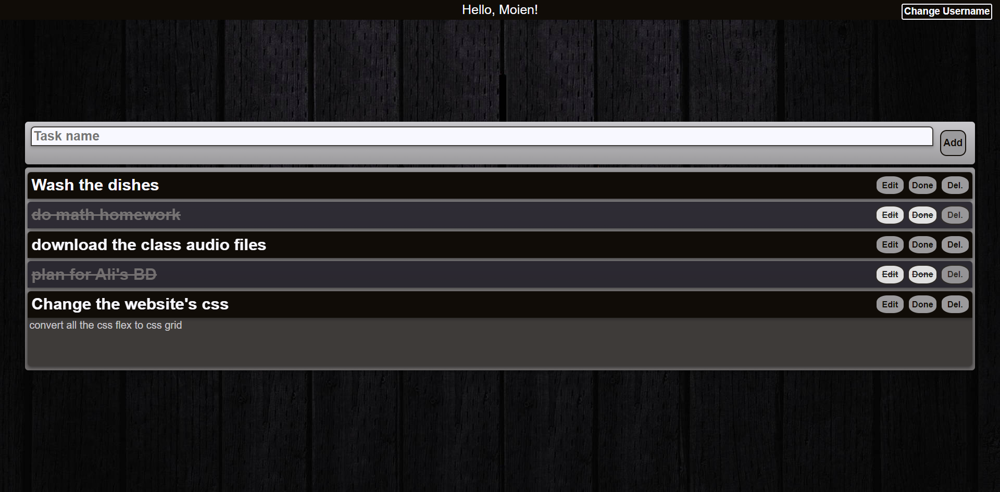

# To do list

## Table of contents

- [Overview](#overview)
  - [The challenge](#the-challenge)
  - [Screenshot](#screenshot)
  - [Links](#links)
- [My process](#my-process)
  - [Built with](#built-with)

## Overview

### The challenge

Users should be able to:

- View the optimal layout for the site depending on their device's screen size
- See hover states for all interactive elements on the page
- Save their to do list even when the exit or refresh the browser
- Edit their tasks and mark them as done/undone

### Screenshot

## Desktop version :

## Mobile version :

### Links

- Live Site URL: (https://moienheydari.github.io/to-do-list/index.html)

## My process

### Built with

- [React](https://reactjs.org/) - JS library
- Semantic HTML5 markup
- CSS custom properties
- CSS Flexbox
